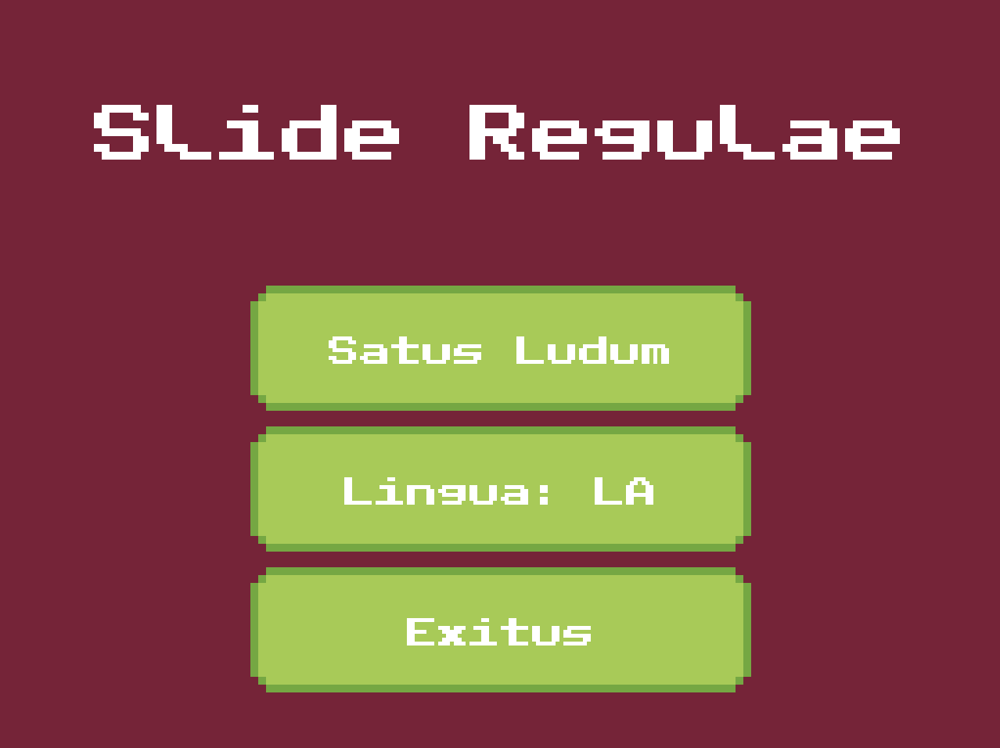
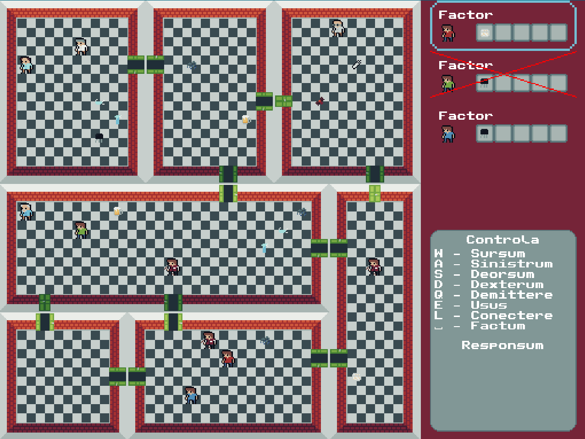

# Zeusz csapat - A Logarléc
*BMEVIIIAB11 - Szoftver projekt laboratórium*

[Feladatkiírás](docs/task.md)

## Csapat tagjai
- Balla Gergely
- Joób Zalán
- Nagy Alexandra
- Tóth Boldizsár
- Zelei Mátyás

## Eredmény
Fázisonkénti részletesebb értékelés a dokumentációknál.

Végeredményben 86%-ot értünk el, ezzel a csapat minden tagja 5-öst kapott, és 12 IMSc pontot szereztünk.

## Képernyőképek

## Tapasztalatok
Ezzel a repo-val részben az is a célom, hogy valamennyi segítséget nyújtson azoknak, akik a jövőben hallgatják ezt a tárgyat.

### Dokumentáció
LaTeX-ben készült, mi kényelmesebbnek találtuk, mint a Word. Overleaf-ben szerkesztettük, ott lehetőség van real-time közösen dolgozni rajta, ez mindig az adott fázis végén a hozzá tartozó pdf-el együtt felkerült GitHub-ra is.

Az egyes fázisokra kapott értékelés, esetleges megjegyzések megtalálhatóak a [docs/](docs/) mappában. A [README](docs/README.md)-ben be van linkelve az adott fázisokhoz leadott dokumentáció.

Diagrammok PlantUML-ben készültek. Ez osztálydiagrammoknál nem mindig a legkényelmesebb, főleg amikor már elég sok osztály van, mivel nem nagyon lehet manuálisan befolyásolni az elrendezést. Szekvencia diagrammokra viszont nagyon kényelmes (főleg egy-két makro után) szinte olyan, mint ha pszeudo kódot írnál, plusz jó eséllyel szintaktikailag is megfelelő lesz a diagram.

### Projekt menedzsment
A feladatok nyomon követésére Issue-kat használtunk GitHub-on. A fő kommunikációs csatortnánk a Discord volt, de egyes feladatoknál felmerült kérdéseket, problémákat sokszor az adott Issue kommentjeiben tárgyaltuk meg. Ez sokszor egyébként egész kényelmes volt, hogy nem kellett keresgélni, hogy adott feladatról hol mit beszéltünk, mert ott volt minden az Issue alatt.

Az Issue-kon kívül a [GitHub Project](https://github.com/users/sn4k3ch4rm3r/projects/7)-et használtuk még. Itt kicsit részletesebben lehet kezelni, hogy melyik feladat melyik fázishoz tartozik, meddig kéne elkészüljön, éppen hogy áll stb.

### Verziókezelés
Mindenképpen érdemes git-et használni. Megosztásban legtöbb tapasztalatom GitHub-al van, illetve egyéb GitHub funkciókat is használtunk, de vannak alternatív megoldások is (pl. GitLab).

A branching nem sikerült teljesen tisztára mindig, de igyekeztünk egy Gitflow szerű stratégiát követni. Bár ez is igazából csak a kódolási fázisoknál működött jól, amikor csak dokumentáció kellett gyártani akkor többnyire egy közös branchen dolgoztunk. A fejlesztésnél viszont jól jött, hogy adott branch-en egyszerre csak egy feladat készült, így Pull Request-ben lehetett review-zni, és ez egész átláthatóbb így.

Mind commit message-ek, mint branch elnevezéseknél szerintem érdemes valami értelmeset megadni. Szórakoztató tud az is lenni, amikor a commit üzenetek rücsi mezőként vannak használva, de később az is tud segítség lenni, ha a commit-okról ránézésre lehet sejteni, hogy mi történt ott.

### Tervezés
Általában érdemes egyszerűbb megoldásra törekedni, bár ezt a tárgy követelmény rendszere nem mindig engedi. Mi a tárgy elején még lelkesek voltunk, hogy milyen menő játékot lehetne ebből kihozni, de a félév végére nagyon szűknek tűnt az idő, és egy csomó mindent így is kihagytunk az eredeti terveinkből. Emiatt érdemes eleve úgy tervezni, hogy egyszerű legyen megvalósítani, lesz úgy is elég szenvedés vele.

Tervezési mintákban nekünk nagy segítség volt a [Refactoring Guru](https://refactoring.guru/design-patterns) weboldal. Mind abban, ha volt egy adott minta azt hogyan kéne implementálni, mind abban, ha volt valamilyen probléma azt hogyan tudnánk legjobban megoldani.
